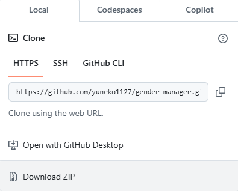

# 性別マネージャー

性別マネージャーは、Web上にある性別に関する入力を支援する拡張機能です。
Chrome ウェブストアでも[性別マネージャー](https://chromewebstore.google.com/detail/%E6%80%A7%E5%88%A5%E3%83%9E%E3%83%8D%E3%83%BC%E3%82%B8%E3%83%A3%E3%83%BC/kofifkdfnmaaolbcpijnmpihdboaeejm)で公開しています。

## 使い方
もっとも手軽な方法は、Chrome ウェブストアに公開されている[性別マネージャー](https://chromewebstore.google.com/detail/%E6%80%A7%E5%88%A5%E3%83%9E%E3%83%8D%E3%83%BC%E3%82%B8%E3%83%A3%E3%83%BC/kofifkdfnmaaolbcpijnmpihdboaeejm)を追加する方法です。

これ以降は、Webストアへ更新されていない機能を利用したいときの手順です。

### 改変しないで使う
1. このリポジトリのコードをダウンロードする。一番手軽なのは**Download Zip**です。
1. Chrome拡張機能のページ[chrome://extensions/](chrome://extensions/)にアクセス
1. 左上のパッケージ化されていない拡張機能を読み込むから、フォルダを選択。

### 改変して使う
このプログラムのメインプログラムは、**content_script.js**です。  
content_script.jsの上部で定義している**KEY_WORDS**と**VALUE_TO_TEXT**を変更すると適用するフォームとテキスト入力に対してどの値を規定で入力するかを変更することができます。**KEY_WORDS**を変更すると、性別欄以外の入力欄にも適用できるかもしれません。  
是非フォークして様々な入力欄に対してのマネージャーができることを願っています。

## お願い
性別欄に対する変更の場合は、是非プルリクエストを送っていただけると助かります。コードの改変方法がわからないときは、**Issues**に機能要求やバグ報告をしていただけると対応できるかもしれません。

性別欄以外に関して変更をした場合は、プルリクエストに対応することができません。是非自身のリポジトリで公開しましょう。

## 謝辞
このプログラムは、2024年度の[SecHack365](https://sechack365.nict.go.jp/)の成果物です。
